# debezium-poc-docker-compose

PostgreSQL-Debezium(+fluentd)-Kafka PoC



## PostgreSQL 接続

```sh
psql -h localhost -p 5432 -U sample source_db
```

## Debezium 設定確認

```sh
curl localhost:8083/connectors/sample-connector
```

## Debezium 設定投入

```sh
curl -i -v -X POST -H "Accept:application/json" -H "Content-Type:application/json" -d @debezium-init/param.json localhost:8083/connectors/
```

## fluentd 標準出力確認

```sh
docker-compose logs -f fluentd
```
